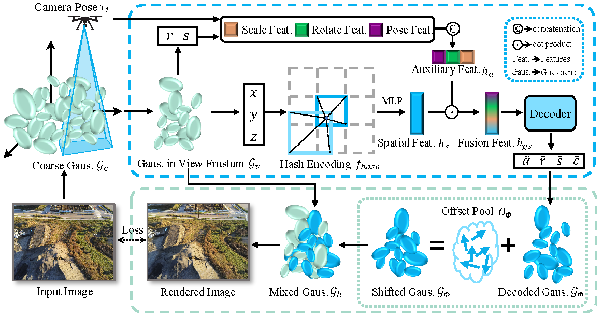

# MixGS
<b>MixGS</b>: Holistic Large-Scale Scene Reconstruction via Mixed Gaussian Splatting [[arXiv](https://arxiv.org/pdf/2505.23280)]

--------------------------

## Introduction

We introduce MixGS, a novel holistic optimization method for large-scale scene reconstruction.

## Method

