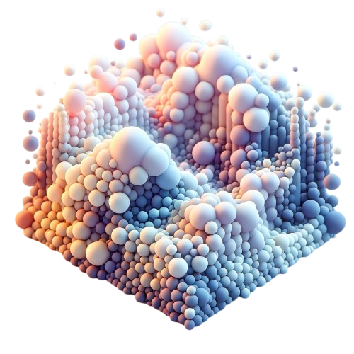
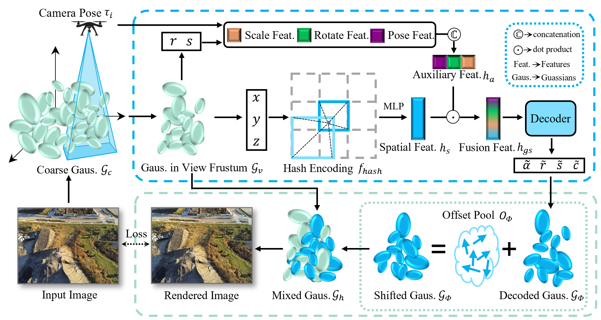

<br>
<p align="center">
<h1 align="center"><strong>Holistic Large-Scale Scene Reconstruction via Mixed Gaussian Splatting</strong></h1>
  <p align="center">
    <a href="https://azhuantou.github.io/">Chuandong Liu</a>&emsp;
    Huijiao Wang&emsp;
    <a href="http://dvs-whu.cn/">Lei Yu</a>&emsp;
    <a href="http://www.captain-whu.com/zh/person/xiaguisong.html">Gui-Song Xia</a>&emsp;
    <br>
    <em>Wuhan University</em>
    <br>
  </p>
</p>

<div id="top" align="center">

[](https://arxiv.org/abs/2505.23280)
[](https://mixgs.github.io/)

</div>
Recent advances in 3D Gaussian Splatting have shown remarkable potential for novel view synthesis. However, most existing large-scale scene reconstruction methods rely on the divide-and-conquer paradigm, which often leads to the loss of global scene information and requires complex parameter tuning due to scene partitioning and local optimization. To address these limitations, we propose MixGS, a novel holistic optimization framework for large-scale 3D scene reconstruction. MixGS models the entire scene holistically by integrating camera pose and Gaussian attributes into a view-aware representation, which is decoded into fine-detailed Gaussians. Furthermore, a novel mixing operation combines decoded and original Gaussians to jointly preserve global coherence and local fidelity. Extensive experiments on large-scale scenes demonstrate that MixGS achieves state-of-the-art rendering quality and competitive speed, while significantly reducing computational requirements, enabling large-scale scene reconstruction training on a single 24GB VRAM GPU.

<!--  -->

<div style="text-align: center;">
    
</div>


## 🥏 Model of MixGS

### Training Pipeline
<p align="center">
  
</p>

## 🔧 Usage

Note that the configs for four large-scale scenes: Rubble, Building, Residence and Sci-Art has been prepared in `config` folder. Data of these datasets can be prepared according to [Data Preparation](doc/data_preparation.md). 


### Installation
#### a. Clone the repository
```bash
# clone repository
git clone https://github.com/azhuantou/MixGS.git
cd MixGS
mkdir data  # store your dataset here
mkdir output  # store your output here
```

#### b. Create virtual environment
```bash
# create virtual environment
conda create -yn mixgs python=3.10 pip
conda activate mixgs
```

#### c. Install PyTorch
* Tested on `PyTorch==2.0.1`
* You must install the one match to the version of your nvcc (nvcc --version)
* For CUDA 11.8

  ```bash
  pip install torch==2.0.1 torchvision==0.15.2 torchaudio==2.0.2 --index-url https://download.pytorch.org/whl/cu118
  ```

#### d. Install requirements
```bash
pip install -r requirements.txt
pip install ninja git+https://github.com/hturki/tiny-cuda-nn.git@ht/res-grid#subdirectory=bindings/torch
pip install submodules/diff-gaussian-rasterization
pip install submodules/diff-gaussian-rasterization_filter
pip install submodules/simple-knn
```


### Training
Take training the "Rubble Scene" as an example. Different scenes can be trained by changing the `config`.
```bash
python train_mixgs.py --config config/rubble_mixgs.yaml
```
This script will also render and evaluate the result.

### Rendering
The rendering results, include RGB and depth images, can be generated by:
```bash
python render_mixgs.py --model_path output/rubble_mixgs/lightning_logs/version_0/ --config config/rubble_mixgs.yaml --iteration 250000 --skip_train
```

The results are saved in `output/rubble_mixgs/lightning_logs/version_0/test/`.

## 📄 License

This work is under the Apache 2.0 license</a>. For the details, please see the [license file](LICENSE) for terms.

## 🤗 Citation
If you find this repository useful, please use the following BibTeX entry for citation.
```latex
@article{liu2025holistic,
  title={Holistic Large-Scale Scene Reconstruction via Mixed Gaussian Splatting},
  author={Liu, Chuandong and Wang, Huijiao and Yu, Lei and Xia, Gui-Song},
  journal={arXiv preprint arXiv:2505.23280},
  year={2025}
}
```

## 👏 Acknowledgements

This repo benefits from [3DGS](https://github.com/graphdeco-inria/gaussian-splatting) and [CityGaussian](https://github.com/Linketic/CityGaussian). Thanks for their great work!

If you find some help for you, star is a good reward ^_^.
